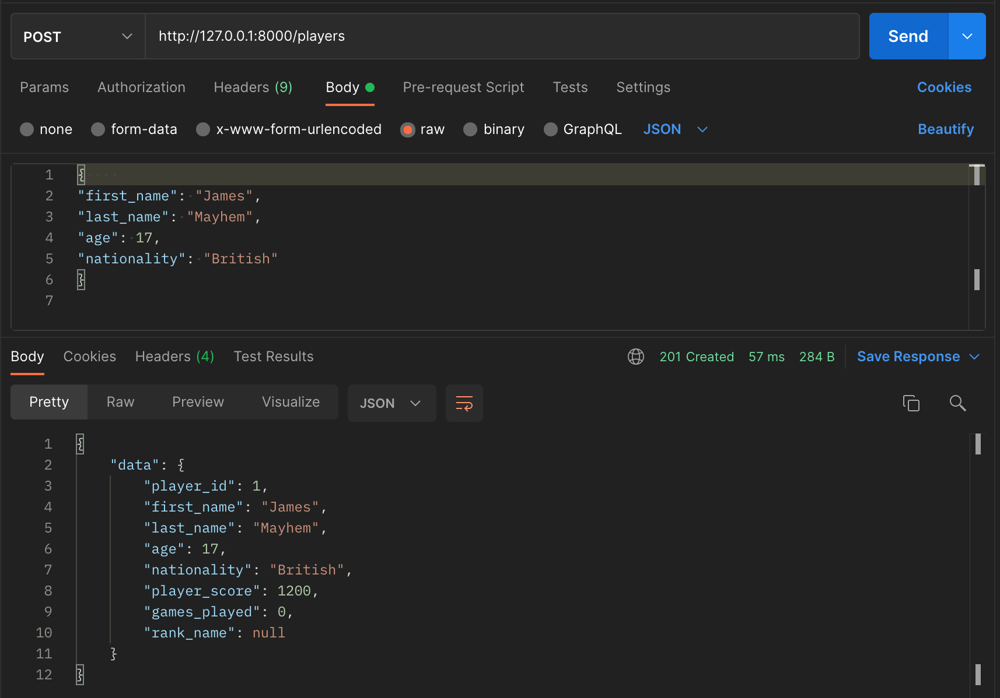

# Tennis Club API

1. ###	  An endpoint for registering a new player into the club
- The only required data for registration is the player’s first name and last name, nationality, and the date of birth
-	No two players of the same first name and last name can be added
-	Players must be at least 16 years old to be able to enter the club
-	Each newly registered player should start with the score of 1200 points for the purpose of the ranking

2.	### An endpoint listing all players in the club
-	It should be possible to list only players of particular nationality and/or rank name (see the bottom of the document) or all players
-	The list should contain the following information for every player:
-	the current position in the whole ranking
-	first and last name
-	age
-	nationality
-	rank name
-	points
-	The players should be ordered by points (descending)
-	The unranked players should also be ordered by points (descending) but should appear at the bottom of the list, below all other ranks

3. ###	An endpoint for registering a match that has been played
-	It should require providing the winner and the loser of the match
-	The loser gives the winner 10% of his points from before the match (rounded down)
-	For example, if Luca (1000 points) wins a match against Brendan (900 points), Luca should end up with 1090 points after the game and Brendan with 810
-	If Daniel (700 points) wins a match against James (1200 points), Daniel should end up with 820 points after the game and James with 1080
-	The business logic behind calculating new player scores after a match should be unit-tested

### Rank List

| Rank    |Points|
|---------|------|
|Unranked |(The player has played less than 3 games)|
|Bronze| 0 – 2999|
|Silver | 3000 – 4999 |
|Gold | 5000 – 9999|
|Supersonic Legend| 10000 – no limit|


## Setup

First create a virtual environment and start it. Open the terminal and paste the following
'''
python3 -m venv venv
source ./venv/bin/activate
'''

Now install the following

```
pip install "fastapi[all]"
pip install psycopg2-binary 
```

Also make sure you have Postgres installed and create a database called 'tennis_club'. You can create the database with TablePlus or Pgadmin or you can go to your terminal and type the following:

```
psql
CREATE DATABASE tennis_club
```
the first line opens up the postgres shell and the second line created the database

Now go the main.py file and make the following changes:

- in Line 23, change the username to whatever it is on your computer. For me it was 'Shahzaib' as my superuser. if your superuser also has a password, add a password argument and set it to your password. For example
```
conn = psycopg2.connect(host='localhost', database='tennis_club', user='Jeremy',password = 'YOURPASSWORD cursor_factory=RealDictCursor)
```
Note: do not publish your password if you add this repository online, use environmental variables  

Now go back to your terminal and type the following:

```
psql
\i ./db/01_add_constraint.sql
```

This creates your tables and checks for age/name constraints. Use TablePlus to verify if they have been created if you would like. It does this by running the  01 sql file in the db folder

Now all you need to do is run the server with the following command:

```
uvicorn main:app  --reload
```

The best way I found to test the endpoints of the API is to use Postman

NOTE: the api routes are CASE SENSITIVE

for instance if you sent a POST request to the following url:

```
http://127.0.0.1:8000/players
```

with the following request:

```
{
"id": 1,
"first_name": "James",
"last_name": "Mayhem",
"age": 17,
"nationality": "British",
"player_score": 3000
}
```

and now you are doing a GET request by searching tennis players by nationality to the following url:

```
http://127.0.0.1:8000/players/British
```

You will find James. However, if you typed british instead of British, you will receive a null response

Additionally, if you are wondering where i got the url from; once you run the server it gives you the url (which should be the same for you) and as for the routes, they are in the main.py file

### API SCREENSHOTS

1.  Creating a player (the sql script in the db folder checks for age and name constraints)


Note: rank_name is by default set to null. Once you do a get request searching by rank name, the 03 sql script is run in the db folder and updates all the rank_name values based on games played and points

2. Creating a player without default player_score


3. Search by rank (remember it is case sensitive)


4. Search by nationality (we get James, our only British candidate)


5. Error message when we add someone younger than 16


6. Error when we add another person with the same first name and last name (another candice mayhem)


7. Create match


### Final Note

- Unfortunately due to some factors out of my control, i did not have the time to update the winners/losers points based off the matches and test that business logic. However, I will fix that sometime this week during my free time
